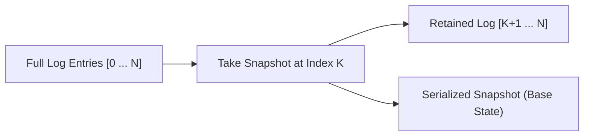

# Raft Snapshot Compaction & Install Skill

Robust, zero-dependency Python implementation of **Raft Log Compaction and InstallSnapshot RPC Handling**.

## Features
- **Log Compaction**: Truncates prefix log entries while retaining point-in-time state machine image.
- **Fast Catch-Up**: Streams snapshots to lagging followers to bypass long transaction backlogs.
- **Zero External Dependencies**: Pure Python standard library.
- **Native MCP Protocol**: JSON-RPC 2.0 stdio server compatible with Claude Desktop, Cursor, and Windsurf.

## Architecture

